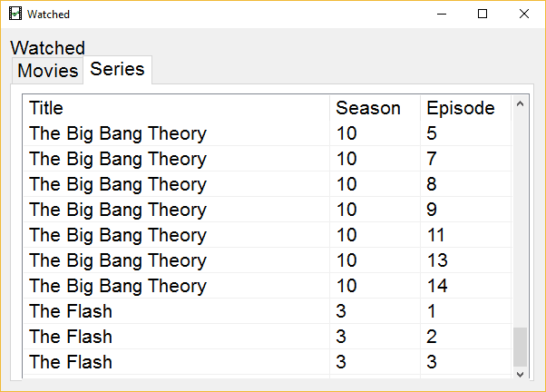

# Watched

Show which movies or series have already been watched in Kodi.

## Prerequisites
- Kodi: https://kodi.tv/
- Add-on WatchedList: http://kodi.wiki/view/Add-on:WatchedList

## Configuration
Watched can be configured in the file watched.ini
- database: Location of WatchedList sqlite-database
### Movies
- moviesTabname: Title
- moviesColumns: Headlines and widths
- moviesQuery: Query
### Series
- seriesTabname: Title
- seriesColumns: Headlines and widths
- seriesQuery: Query
- seriesSummarizeQuery: Query for summarized episodes
- seriesSummarize: Summarize episodes per season
- seriesSummarizeCol: Column used to summarize
### Window
- title: Window-title
- font: Font
- fontsize: Fontsize
- width: Window-width
- height: Window-height
- startTab: = Open tab-number at start (0-1)
- maximized: Start window maximized
