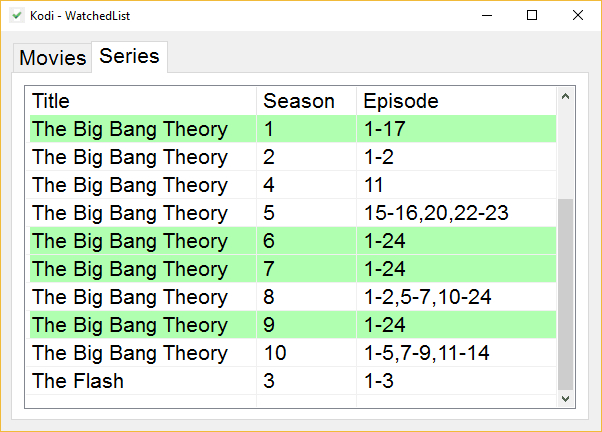

# Watched

Show which movies or series have already been watched in Kodi.

## Prerequisites
- Kodi: https://kodi.tv/
- Add-on WatchedList: http://kodi.wiki/view/Add-on:WatchedList

## Configuration
Watched can be configured in the file watched.ini
- database: Location of WatchedList sqlite-database
- movies: Query for movies
- episodes: Query for episodes
- font: Font
- fontsize: Fontsize
- width: Window-width
- height: Window-height
